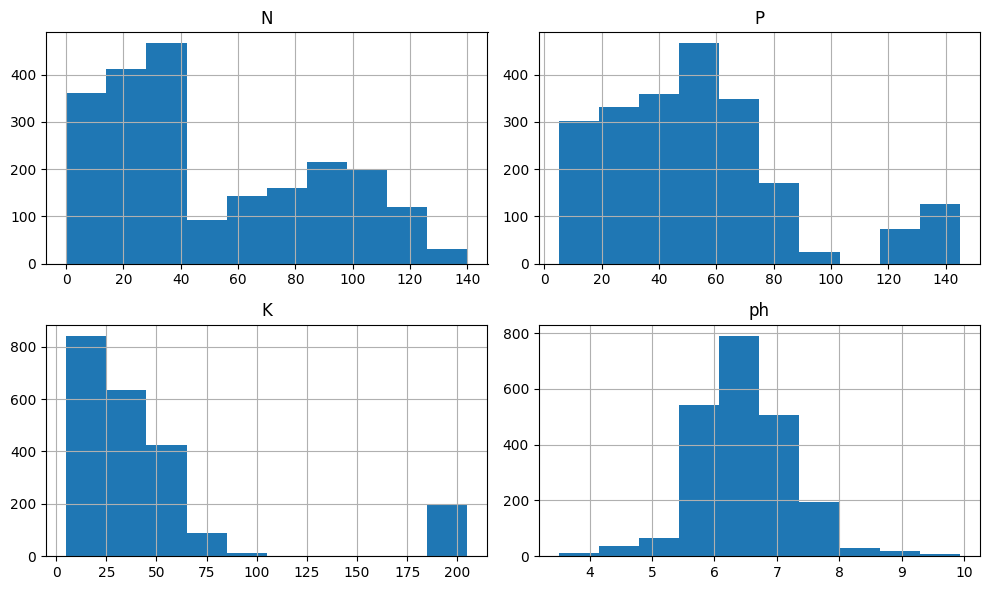
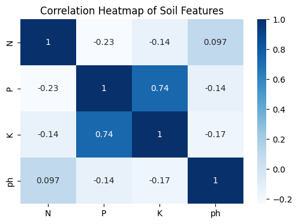

# Crop Recommendation Using Machine Learning  
*Identifying the most informative soil measurement for crop recommendation using interpretable machine learning models.*

**Dataset:** 2,200 soil samples  
**Features:** Nitrogen (N), Phosphorous (P), Potassium (K), pH  
**Technique:** Logistic Regression baseline models (single-feature comparison)  
**Key Insight:** Potassium (K) provides the strongest predictive signal for crop selection

---

## Business Context

Choosing the right crop for the right soil conditions is a critical decision in agriculture. Soil nutrients directly influence plant growth, yield potential, and long-term soil sustainability.

Farmers and agronomists often rely on multiple soil measurements to determine which crop is most suitable for a specific field. However, understanding **which soil factor provides the strongest predictive signal** can simplify early assessments and improve decision-making.

This project explores how different soil nutrients influence crop selection by evaluating the predictive power of individual soil measurements. The goal is not only to build a predictive model, but also to generate **clear and interpretable insights about which soil property carries the most strategic importance**.

---

## Dataset

The dataset used in this project (`soil_measures.csv`) contains soil measurements and the recommended crop for each sample.

Each row represents a soil sample and includes:

- **N:** Nitrogen level  
- **P:** Phosphorous level  
- **K:** Potassium level  
- **pH:** Soil acidity or alkalinity  
- **crop:** Recommended crop type (target variable)

Dataset characteristics:

- **2,200 soil samples**
- **4 numerical features**
- **22 crop categories**

Example crop classes include:

- rice
- maize
- chickpea
- banana
- mango
- cotton
- coffee

---

## Problem Statement

Which individual soil measurement provides the strongest predictive signal for determining the most suitable crop?

Answering this question helps identify which soil factor carries the greatest importance when making early crop selection decisions.

---

## Objectives

- Understand the distribution of soil features
- Explore relationships between soil measurements
- Train simple baseline models using one feature at a time
- Compare predictive performance across soil variables
- Identify the most informative soil measurement
- Translate modeling results into agricultural insights

---

## Methodology

1. **Dataset Inspection**  
   Initial exploration of dataset structure, data types, and basic statistics.

2. **Exploratory Data Analysis (EDA)**  
   Visualization of soil feature distributions and analysis of relationships between variables.

3. **Correlation Analysis**  
   Evaluation of feature relationships using a correlation matrix and heatmap.

4. **Train–Test Split**  
   Data split into training (80%) and testing (20%) subsets.

5. **Baseline Modeling**  
   Logistic Regression models trained using **one soil feature at a time** to evaluate their individual predictive power.

6. **Model Comparison**  
   Accuracy scores compared across features to determine which variable carries the strongest signal.

---

## Tools & Technologies

- Python  
- Pandas  
- NumPy  
- Matplotlib  
- Seaborn  
- Scikit-learn  
- Logistic Regression  
- Train-test split  
- Accuracy evaluation metrics  

---

## Exploratory Data Analysis Highlights

### Distribution of Soil Features



**Figure:** Distribution of Nitrogen, Phosphorous, Potassium, and pH values across soil samples.

Observations:

- **Nitrogen (N):** Wide distribution indicating diverse soil nutrient conditions.
- **Phosphorous (P):** Values are more concentrated in certain ranges.
- **Potassium (K):** Large spread of values, suggesting strong variability across samples.
- **pH:** Mostly within realistic agricultural ranges from acidic to slightly alkaline soils.

---

### Correlation Between Soil Features



**Figure:** Correlation matrix between soil features.

Observations:

- Most soil variables show **weak correlations**, indicating they provide relatively independent information.
- A stronger correlation exists between **Phosphorous and Potassium**, but the relationship remains moderate.

This supports evaluating the predictive value of each variable independently.

---

## Modeling Approach

A **Logistic Regression model** was trained using **one feature at a time**.

This approach allows a clear comparison of how much predictive signal each soil variable carries individually.

The features evaluated were:

- Nitrogen (N)
- Phosphorous (P)
- Potassium (K)
- pH

Model performance was evaluated using **accuracy on the test dataset**.

---

## Model Performance

Accuracy scores obtained using each individual soil feature:

| Feature | Accuracy |
|------|------|
| Nitrogen (N) | 0.143 |
| Phosphorous (P) | 0.189 |
| Potassium (K) | **0.248** |
| pH | 0.098 |

Although the overall accuracy is modest due to the **multi-class nature of the problem (22 crops)**, the comparison clearly shows which variable provides the strongest signal.

**Potassium (K)** achieved the highest predictive accuracy when used alone.

---

## Key Insights

**Potassium emerges as the strongest individual predictor**  
Among the soil variables tested, potassium provides the most informative signal for distinguishing between crop types.

**Soil variables behave largely independently**  
Low correlations between features indicate that each nutrient contributes different information about soil conditions.

**Simple baseline models can still generate useful insights**  
Even a straightforward logistic regression model can reveal which soil factors carry the most predictive value.

---

## Business Impact

Potential applications include:

**Agricultural decision support**  
Early soil tests focusing on potassium levels could provide useful signals for crop suitability assessments.

**Soil management strategies**  
Understanding which nutrients most influence crop selection helps guide fertilization planning.

**Simplified field diagnostics**  
In early-stage soil evaluations, prioritizing the most informative measurements can improve efficiency.

---

## Limitations

Some limitations should be considered:

- Only **four soil measurements** were used
- Other environmental factors such as **temperature, rainfall, or soil texture** were not included
- Models were intentionally simplified to evaluate features individually

These constraints limit predictive accuracy but allow clearer interpretation of feature importance.

---

## Next Steps

Possible extensions for this project include:

- Incorporating additional environmental features (rainfall, humidity, temperature)
- Testing multi-feature models to improve predictive performance
- Applying ensemble models such as Random Forest or Gradient Boosting
- Building an interactive dashboard for crop recommendation analysis

---

## Repository Structure

```
.
├── data
├── notebooks
├── images
├── requirements.txt
└── README.md
```

---

## Conclusion

This project demonstrates how simple machine learning models can be used to extract meaningful insights from agricultural data.

By comparing the predictive power of individual soil measurements, the analysis identified **potassium (K) as the most informative variable** for distinguishing crop suitability in this dataset.

Beyond predictive modeling, the project highlights how exploratory analysis and interpretable models can support **practical decision-making in agricultural planning and soil management**.
